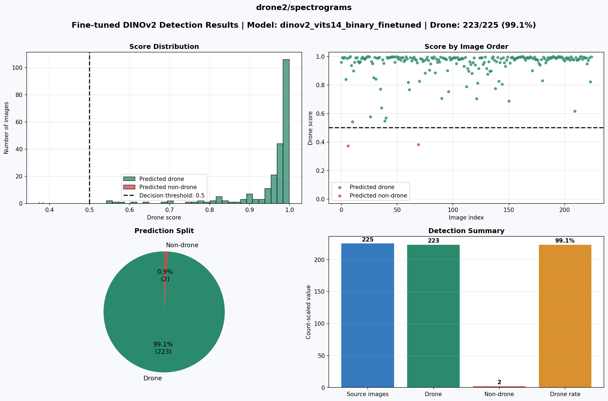

**Chữ đậm**

_Chữ nghiêng_

~~Gạch Ngang~~

# Tiêu đề lớn

## Tiêu đề nhỏ

### Nhỏ hơn nữa

- Item 1
- Item 2
- Item 3

1. Bước 1
2. Bước 2
3. Bước 3

[Google](https://google.com)

Dùng lệnh `npm install`

```js
console.log("Hello world");
```

- [x] Hoàn thành
- [ ] Chưa làm

| Tên  | Tuổi |
| ---- | ---- |
| An   | 20   |
| Bình | 22   |

> Đây là trích dẫn

# 1toanbin

## Fine tune

### Not refactor

- Các model được train trên tập balanced
  - Dinov2 ViT s 14
    
  - OpenClip
  - SigLip
  - Swin v2 s Tranformer Small
  - ResNet18
  - ResNet50
